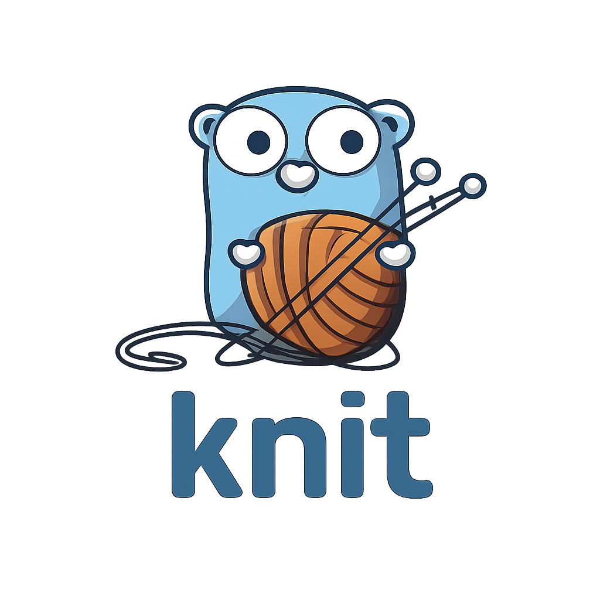

<div align="center">
  
  <h1>Knit</h1>
  <p>Zero-config tool for Go workspace monorepos</p>
</div>

## Why Knit?

Built for Go monorepos using `go.work`. Run commands only on affected modules.

**Use cases:**
- **CI**: Test only what changed in a PR
- **Pre-commit**: Format only modified modules
- **Local dev**: Run commands on specific modules

## Install

```sh
go install github.com/nicolasgere/knit@latest
```

## Commands

```sh
knit test              # Run tests on all modules
knit fmt               # Format all modules
knit affected          # List changed modules
knit graph             # Show dependency graph
```

### Options

```sh
-p, --path       Workspace root
-t, --target     Specific module
-a, --affected   Run on affected modules only
-b, --base       Git ref to compare (with --affected)
-c, --color      Colored output
```

## Examples

```sh
# Run all tests with color
knit test --color

# Run tests on affected modules (CI)
knit test --affected

# Run tests on affected modules (compare against develop)
knit test --affected --base develop

# Format affected modules
knit fmt --affected

# Test specific module
knit test -t example.com/api

# Get list of affected modules
knit affected --merge-base

# Visualize dependencies
knit graph -f dot | dot -Tpng -o deps.png
```

## CI

```yaml
# Simple: test affected modules
- run: knit test --affected --color

# Or parallelize with GitHub matrix
- id: affected
  run: echo "matrix=$(knit affected --merge-base -f github-matrix)" >> $GITHUB_OUTPUT
- strategy:
    matrix: ${{ fromJson(steps.affected.outputs.matrix) }}
  run: knit test -t ${{ matrix.module }}
```

## Pre-commit

```yaml
# .pre-commit-config.yaml
repos:
  - repo: local
    hooks:
      - id: knit-fmt
        name: Format affected modules
        entry: knit fmt --affected --base HEAD
        language: system
        pass_filenames: false
```
